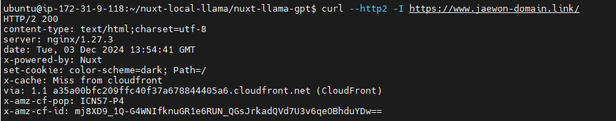
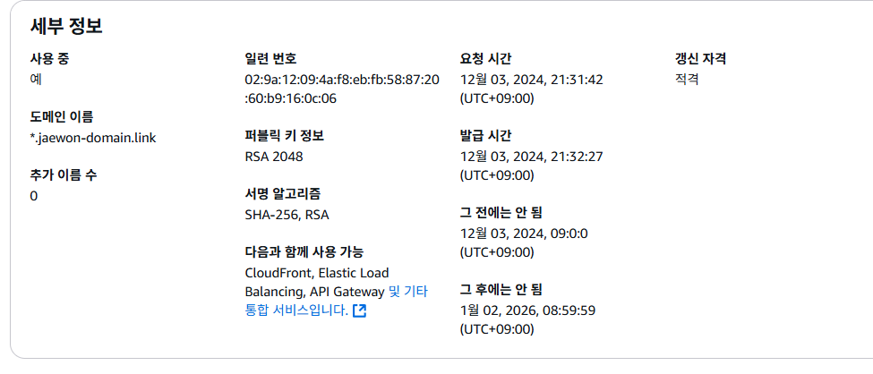
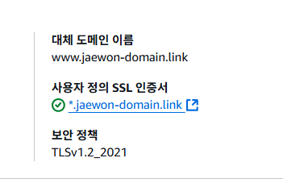

# Route53, CloudFront 를이용한 https , http2

## http2는 그냥 cloudfront에 적용시킬수있다.



```
curl --http2 -I https://www.jaewon-domain.link/
HTTP/2 200
```

CloudFront를 통해 배포된 도메인을 통해 http2인것을 확인함 

Alb니 elb니 머니 복잡해서 내가 한 방법 까먹기 전에 바로 메모한다 생각한다. 

## Route 53

- 도메인을 등록할수있다. 등록비 5달러면 1년한다.
- ACM를 통해 CNAME을 레코드로 등록하고 ( 이과정을 쉽게 따라할수있다.)
- 다음 도메인을 등록한다. # 이과정은 후에 자세하게 

Route53에서 하는건 이게 전부인데 다른 곳에서 왔다갔다 해야해서 뭔가 복잡하게 느껴진다.

> cname인증서는 바로바로 하자. 검증중에 등록 가능하다. 

# 인증서 !// 버지니아 북부 us-east-1 리전으로 해야한다.

## AWS Certificate Manager(ACM)

인증서를 요청한다. 


다음과 같은 정보로 구매했던 도메인을 도메인이름에 다음과 같이 집어넣는다. 
이거는 이대로 끝 후에 해당 인증서를 사용한 리소스를 볼수있다.

## CloudFront

CDN은 모르겠고 일단 이것으로 http2와 https를 이뤘으니 일단 되었다. 


#### 중요

- 배포 도메인이름 
- http로 연결 하고 http to redirect https하면 외부는 https 내부는 http되는모양 
  - 쿠키 secure: true로 잘됨 ㅇㅇ
- `cname`에 **구매한 도메인 주소** 입력해야한다. 항목추가 눌러야함
- 등록한 인증서 넣기 뭔지 딱보면 안다.
- 배포생성시 `origin domain`, `이름`이 연결하려는 
  EC2의 퍼블릭 IPv4 DNS여야한다. 그래야 ec2와 연결이됨



# 다시 Route53으로

## Route53목록의 마지막

레코드 생성해서 
레코드이름 [].[등록도메인]
value에 cloudfront 배포 도메인 입력하면 끝이다.!!!!!!
